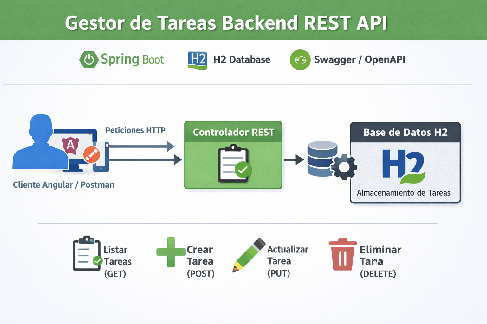

<div style="text-align: justify; line-height: 1.6;">

# Tasks API · Spring Boot REST

<div style="text-align: center;">
  
</div>

API REST desarrollada con **Spring Boot** para la gestión de tareas (*tasks*), con persistencia en base de datos, documentación automática mediante **Swagger / OpenAPI**.

---

## 🎯 Objetivo del proyecto

- Construir una **API REST sencilla y limpia**
- Aplicar buenas prácticas en controladores REST
- Uso de **Spring Data JPA**
- Persistencia en **H2 (en memoria)**
- Documentación automática con **Swagger / OpenAPI 3**
- Proyecto base ideal para prácticas, demos o ampliaciones

---

## 🛠️ Tecnologías utilizadas

- ☕ **Java**
- 🌱 **Spring Boot**
- 🌐 **Spring Web**
- 🗄️ **Spring Data JPA**
- 🧪 **H2 Database**
- 📄 **Swagger / OpenAPI 3 (springdoc)**
- 🚀 **Tomcat embebido**

---

## 📂 Estructura del proyecto

```
src/main/java
└── com.docencia.tasks
    └── TasksApplication.java
    ├── rest
    │   └── controller
    │       └── TaskController.java
    ├── entitys
    │   └── TaskEntity.java
    └── repository
        └── TaskRepository.java
    ...    
```

---

## 📘 Endpoints disponibles

### 📝 Tasks API

| Método | Endpoint | Descripción |
|------|---------|------------|
| GET | `/api/v1/tasks` | Obtener todas las tareas |
| POST | `/api/v1/tasks` | Crear una nueva tarea |
| PUT | `/api/v1/tasks/{id}` | Actualizar una tarea |
| DELETE | `/api/v1/tasks/{id}` | Eliminar una tarea |

---

## 📄 Modelo de datos

### TaskEntity

```json
{
  "id": 1,
  "title": "Aprender Spring Boot",
  "description": "Crear una API REST con Swagger",
  "completed": false
}
```

---

## 📖 Documentación Swagger

### Swagger UI
```
http://localhost:8080/swagger-ui/index.html
```

### OpenAPI JSON
```
http://localhost:8080/v3/api-docs
```

---

## 🗄️ Base de datos H2

### Consola
```
http://localhost:8080/h2-console
```

**JDBC URL**
```
jdbc:h2:mem:tasksdb
```

---

## ▶️ Ejecución

```bash
mvn clean spring-boot:run
```

---

> *Evolucionar y mejorar es el trabajo de cada día.*

</div>
